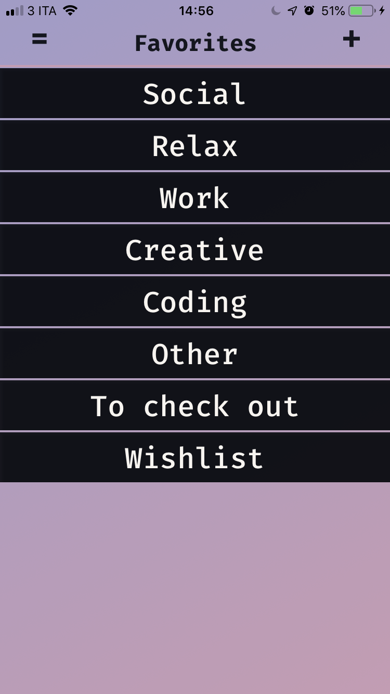
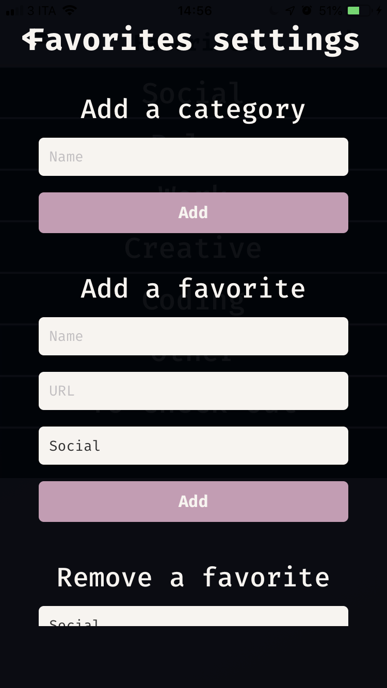
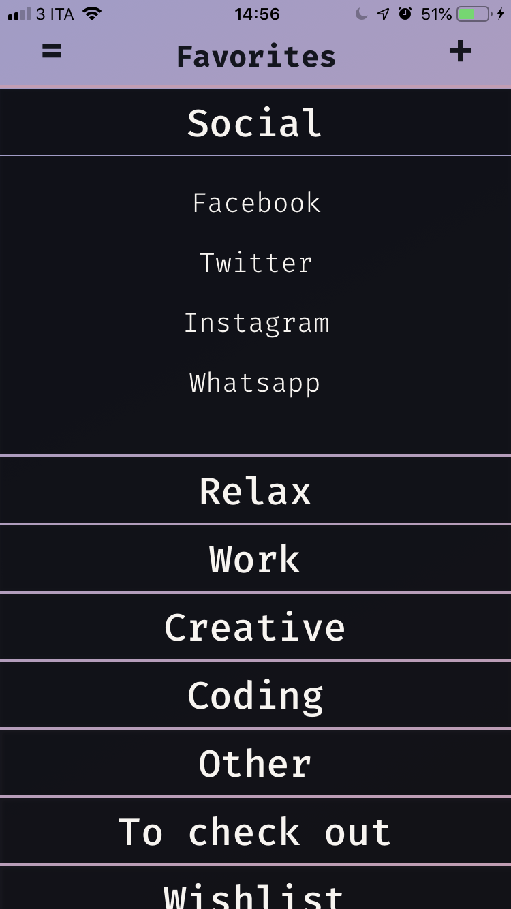
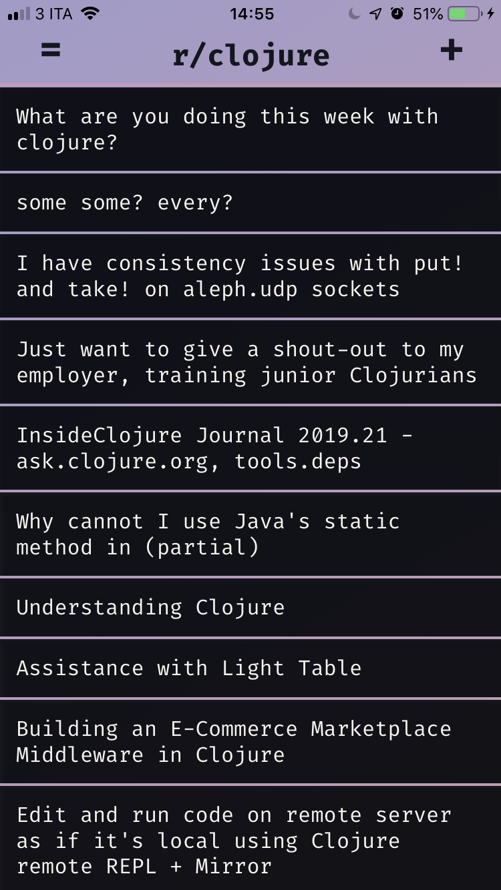
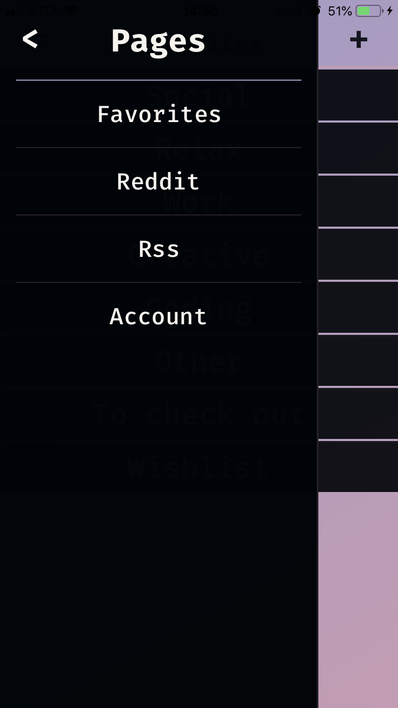

# What is homepage-native?

This is a simple project I made to learn `Clojurescript` and `React-Native`.

It's a mobile client for my other project
[https://github.com/elkiwy/homepage-cljs](Homapege-cljs), so you could check the readme over there to have an updated list of all the features.

I'll try to update this project at the same pace of its brother `Homepage-cljs`.

Right now, the project is _*ios only*_. 
I'll add android support sometimes in the future, but currently there is only the default reagent native page for that.


# Instructions
To be able to build it on your device you need to have *Xcode*, *react-native*, and *re-natal* installed on your machine.

## Build for production
### iOS

Once you have all the tools, clone the repo, open terminal, move to
the project directory and type:

```
lein clean
lein prod-build
```

To build the main `index.ios.js` in release mode.

Then open in Xcode the `homepageNative.xcodeproj` in the `ios` folder.
Edit the scheme for the current project making sure the the `Build configuration` is set to *Release*. 
Once that is done you can connect your device through USB and build the project on it.

### Android
Coming soon...

## Build for development
### iOS
I personally use Emacs with the wonderful [Cider](https://github.com/clojure-emacs/cider) package. If you are familiar with Emacs (Or you are willing to learn it) I highly recommend it.
   

Before starting you should check that your `index.ios.js` is in
development mode. You can regenerate that file in development mode by
opening your terminal into the project folder and calling:

```
re-natal use-figwheel
```

Then, to start with cider you have to:
- open one of the files inside `/src` inside Emacs
- `M-x cider-jack-in-cljs` to start the REPL
- select `figwheel` as your REPL type

Once the REPL is started you have to open the iOS simulator and
connect react-native to it. With a terminal open in the project folder
call:
```
react-native run-ios
```
This will connect to your figwheel repl, open the simulator, and launch the application.

### Android
Coming soon...

# Screenshots

<center>
  
  
  
  
  
  
</center>
	
